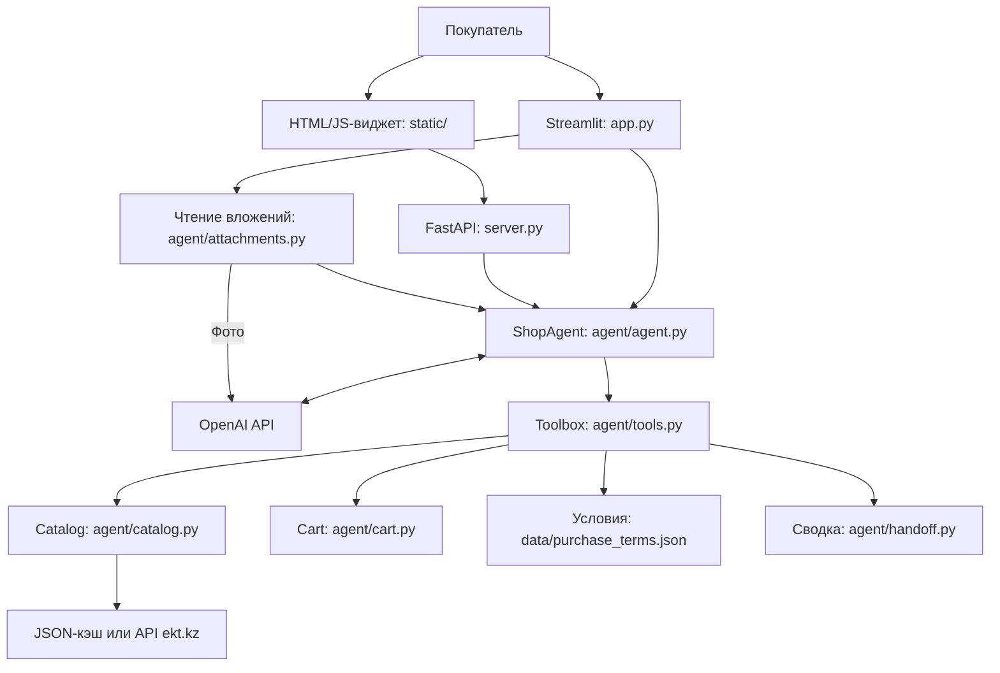

# ⚡ ИИ-консультант ekt.kz

**HackAlem AI · трек «Торговля» · партнёр — ТОО «Электрокомплект».**

Консультант для покупателей электротехники: помогает найти товар, узнать характеристики и остатки по складам, сравнить аналоги и подготовить корзину. Проект решает задачу первичной консультации, с которой покупатель обычно обращается к менеджеру магазина.

В репозитории есть два интерфейса: **Streamlit-демо** с загрузкой спецификаций и **встраиваемый HTML/JavaScript-виджет** с сервером FastAPI. Они используют общие модули каталога, агента и корзины. Для показа жюри включён реальный сохранённый каталог ekt.kz; для ответов модели нужен собственный `OPENAI_API_KEY`.

## Что реализовано

- Поиск по артикулу, названию, бренду и характеристикам. Учитываются опечатки, синонимы «автомат» / «автоматический выключатель», «УЗО» / «устройство защитного отключения», записи ампер и обозначения полюсов.
- Карточки с ценой, характеристиками, суммарным остатком и распределением по складам. Данные берутся из каталога.
- Подбор кандидатов на замену товара с нулевым остатком: совпадающие характеристики, отличия и разница в цене.
- Условия оплаты, доставки, возврата и покупки с сохранёнными ссылками на источники и предупреждениями о противоречиях.
- Корзина через предложение и отдельное подтверждение клиента; проверяются минимальная партия и доступное количество.
- Ссылка на страницу корзины. В HTTP-виджете также восстанавливается диалог после обновления страницы в той же вкладке.
- Казахский язык, рекомендации сопутствующих товаров, сводка для менеджера и проверка вложений — подробнее в разделе «Опционально реализовано».

Это демонстрационный консультант с собственной корзиной. Оформление заказа, оплата и запись корзины в учётную систему партнёра не подключены.

## Must have из ТЗ ekt.kz → как реализовано → как проверить

Все артикулы в таблице есть в сохранённом реальном кэше. Примеры цен и остатков относятся к этому снимку, а не к наличию на сайте в момент показа.

| Must have из ТЗ ekt.kz | Как реализовано | Как проверить |
|---|---|---|
| 1. Наличие, характеристики, сертификаты | `search_products` и `get_product` возвращают карточку из каталога. Если документа сертификата нет, агент сообщает об этом и предлагает обратиться к менеджеру, не придумывая ссылку. | Спросить «Покажи цену, наличие и характеристики 010500008_», затем «Покажи сертификат на 010500008_». В кэше: 25 А, 1 полюс, характеристика C; сертификата нет. Автопроверки: [test_demo_real.py](tests/test_demo_real.py), [test_catalog_api.py](tests/test_catalog_api.py). |
| 2. Аналоги при нулевом остатке с обоснованием | `find_analogs` возвращает доступные кандидаты с `matching_specs`, `differences`, `price_diff_kzt`. Для аппаратов защиты проверяются ток и полюса, для УЗО/дифавтоматов — также ток утечки. | Спросить «Есть ли 11006DEK? Если нет, покажи аналоги и отличия». Остаток исходного товара — 0. Проверить объяснение совпадений и отличий, включая характеристику B у оригинала и возможную C у кандидатов. Тесты: [test_live_regressions.py](tests/test_live_regressions.py). |
| 3. Условия покупки | `get_purchase_terms` читает [purchase_terms.json](data/purchase_terms.json): условия, `source`, дату проверки, предупреждения. | Спросить «Как оплатить заказ, какие условия доставки в Алматы и минимальная партия? Укажи источник». Ответ должен отметить расхождение порогов доставки 30 000 / 15 000 ₸ и не придумывать общий минимум заказа. Тесты: [test_demo_real.py](tests/test_demo_real.py). |
| 4. Корзина только после явного подтверждения с учётом остатков | `propose_add_to_cart` создаёт предложение; `confirm_add_to_cart` вызывает `Cart.confirm()`. Подтверждение проверяется кодом, в отдельном ходе после предложения. Минимум проверяется при предложении, остаток — также при подтверждении с учётом уже добавленного количества. | Попросить «Предложи добавить 2 товара 010500008_». До отдельного «Да, добавь» корзина пуста. На «Нет, не добавляй» она не меняется. Запрос 100 000 единиц этого артикула превышает остаток снимка и должен быть отклонён. Тесты: [test_must_have.py](tests/test_must_have.py), [test_server.py](tests/test_server.py). |
| 5. Ссылка на корзину | Streamlit: `/?cart=<id>`. FastAPI: `/cart/<id>`. Страница читает состав корзины из памяти соответствующего сервера. | После подтверждения открыть ссылку и увидеть 2 товара 010500008_, сумма по снимку — 1 616 ₸. После следующего добавления обновить страницу. Тесты: [test_demo_real.py](tests/test_demo_real.py), [test_server.py](tests/test_server.py). |

## Как работает решение

1. **Входные данные.** Покупатель пишет вопрос или прикладывает спецификацию в Streamlit. Для текстовых документов содержимое извлекается локально; фотография распознаётся моделью через OpenAI API.
2. **Диалог и поиск.** `ShopAgent` определяет язык ответа. Модель выбирает инструменты из `TOOL_SCHEMAS`, например поиск, карточку товара или условия покупки. Артикулы из вложения проверяются по каталогу, результаты передаются агенту как контекст.
3. **Проверка данных.** `Catalog` ищет в загруженной выборке. В режиме API полная карточка при необходимости запрашивается отдельно. Пустой поиск не означает, что товара нет на всём сайте.
4. **Результат консультации.** Клиент получает сведения о товаре, кандидатов на замену с отличиями и условия покупки. При отсутствии сертификата агент сообщает, что документа нет в базе.
5. **Предложение покупки.** Агент показывает товар, количество и сумму, затем спрашивает о добавлении. На этом шаге корзина не меняется.
6. **Подтверждение.** Отдельное сообщение «Да, добавь», «иә», «қосыңыз» или нажатие кнопки проходит проверки `Cart.confirm()`. После успешного добавления выдаётся ссылка на корзину.
7. **Помощь менеджера.** По кнопке или запросу в чате создаётся сводка: запрос клиента, рассмотренные товары, подтверждённая корзина и неподтверждённые предложения. Автоматической отправки менеджеру нет.

## Требования партнёра

| Требование | Реализация и границы |
|---|---|
| Нет изменения корзины без подтверждения | Добавление из инструментов агента и HTTP-интерфейса проходит через `Cart.confirm()`. Предложение само по себе не меняет корзину. |
| Нет выдуманных цен и наличия | Инструменты возвращают значения из каталога; промпт запрещает дополнять их догадками. Если поле или товар отсутствует, это сообщается клиенту. Свободные формулировки модели требуют проверки при демонстрации. |
| Не запрашиваем платёжные данные | В чате и передаче менеджеру не предусмотрен сбор номера карты, CVV/CVC или PIN. В сводке маскируются распознанные реквизиты и исключаются просьбы их прислать. Платёжного интерфейса нет. |
| Приватность | Секреты задаются в `.env`, который исключён из Git; в `.env.example` только плейсхолдеры. Загруженные документы не сохраняются приложением на диск. История диалога и корзины находятся в памяти сервера. Текст диалога и контекст обрабатываются внешним OpenAI API; полная анонимизация всей истории не реализована. |
| Подтверждение проверяется в коде; текст вложения не может подтвердить покупку | Проверяются отдельный ход клиента, явное согласие и отрицания. `last_user_message` берётся из сообщения клиента до добавления контекста вложения. Это проверяет [test_attachments.py](tests/test_attachments.py). |
| Объяснимость аналогов | Выдаются совпадения, различия и разница цены. Подбор по части характеристик не является гарантией полной взаимозаменяемости; различия типа B/C требуют уточнения. |
| Виджет для встраивания в сайт | `static/widget.js` создаёт кнопку чата и iframe с `static/widget.html`. Серверная часть — `server.py`. Пример встраивания приведён ниже. |
| Десктоп и мобильная версия | HTML-виджет содержит `viewport`, адаптивную ширину и высоту относительно экрана, перенос длинного текста и прокрутку. Для жюри предусмотрена ручная проверка на ширине 320 px. Это веб-интерфейс, отдельного мобильного приложения нет. |

В демо нет авторизации владельца сессии или корзины: доступ определяется идентификатором в запросе/ссылке. Поэтому текущую реализацию нельзя считать готовым защищённым сервисом для персональных данных реальных клиентов.

## Опционально реализовано

| Возможность | Что доступно |
|---|---|
| Казахский язык | Автоопределение языка диалога, сохранение языка при коротких ответах и артикулах. В Streamlit есть выбор «Қазақша», переведённые кнопки и сообщения об ошибках модели. «Иә» и «қосыңыз» проходят обычные проверки корзины. Подписи HTML-виджета и часть HTTP-сообщений пока на русском. |
| Сопутствующие товары | `recommend_accessories`: к автомату ищутся DIN-рейки и боксы, к кабелю — гофра. Предлагаются только найденные в каталоге позиции с остатком не ниже минимальной партии. При отсутствии товара не предлагаются даже категории вместо него. В текущем кэше подходящих дополнений нет; совместимость найденных в будущем позиций требует проверки. |
| Эскалация на менеджера | Кнопка «Позвать менеджера» есть в Streamlit и HTML-виджете. `request_manager` готовит сводку без дополнительного вызова модели. В Streamlit её можно скачать в TXT/UTF-8. Передача по контактам сайта — ручная; CRM и уведомления менеджеру не подключены. |
| Вложения | В Streamlit: Excel `.xlsx`, Word `.docx`, текстовый PDF, фото `.jpg`, `.jpeg`, `.png`. Поддерживаются проверка найденных позиций и поиск аналогов при нулевом остатке. Лимиты: 10 МБ на файл, 50 строк позиций и 40 000 символов извлечённого текста. В HTTP-виджете загрузки файлов нет. |

## Технологии

Зависимости перечислены в [requirements.txt](requirements.txt); отдельного фронтенд-сборщика не требуется.

| Компонент | Технология и назначение |
|---|---|
| Основной язык | Python 3.11+ |
| Демонстрационный интерфейс | Streamlit |
| HTTP-сервер | FastAPI, Uvicorn; модели запросов и валидация — Pydantic |
| Виджет | HTML, CSS, JavaScript; iframe и Shadow DOM в загрузчике |
| AI-агент | OpenAI Python SDK, Chat Completions с вызовами инструментов (*function calling*) |
| Модель | В коде и шаблоне окружения по умолчанию настроена `gpt-5-mini`; меняется через `OPENAI_MODEL`. Для фото используется `OPENAI_VISION_MODEL`, если задана, иначе `OPENAI_MODEL` |
| Каталог партнёра | HTTPS API ekt.kz, библиотека `requests`, Basic Auth для доступа к API |
| Конфигурация | `python-dotenv`, файл `.env` |
| Документы | `openpyxl` для XLSX, `python-docx` для DOCX, `pypdf` для текстового PDF; распознавание фото — OpenAI API |
| Поиск | Нормализация, словарь синонимов, `difflib` для опечаток и фильтры характеристик |
| Хранение | JSON-файлы каталога/условий; сессии и корзины в памяти процесса. База данных и векторный индекс не используются |
| Тесты | `pytest`, FastAPI TestClient / `httpx`, Streamlit AppTest, моки внешних вызовов |

## Архитектура проекта



- `ShopAgent` ведёт историю и выполняет до восьми раундов ответа/инструментов; в последнем раунде новые вызовы инструментов запрещены. При ошибке модели формируется ответ по доступным полным карточкам кэша.
- `Toolbox` описывает доступные модели операции и преобразует их результаты в данные для ответа.
- `Catalog` загружает и нормализует товары, выполняет поиск и подбор аналогов/дополнений.
- `Cart` хранит подтверждённые позиции и отдельный список предложений. `CartStore` используется Streamlit; FastAPI хранит сессии и корзины в собственных реестрах, с блокировкой параллельных запросов одной сессии.
- `agent/language.py` определяет язык; `agent/handoff.py` формирует сводку и маскирует платёжные данные в её контексте.
- `scripts/fetch_catalog.py` сохраняет полные карточки выбранных страниц API в кэш.
- `tests/` содержит проверки логики, реальных сохранённых карточек, вложений, Streamlit и HTTP-интерфейса.

Streamlit и FastAPI, запущенные отдельными процессами, **не делят историю и корзины**. Ссылку на корзину нужно открывать у того сервера, где был создан диалог.

## Установка и запуск

### Перед запуском

Нужны Git и **Python 3.11 или новее**. Установка пакетов и работа с OpenAI требуют доступа к интернету. Для основной демонстрации достаточно своего `OPENAI_API_KEY`: реальный кэш уже хранится в репозитории, логин и пароль ekt.kz для режима `cache` не нужны.

Если `.env` уже существует, сохраните его и пропустите команду копирования шаблона. Настоящие ключи и учётные данные записывайте только в `.env`.

### Windows — PowerShell

Установите **Python 3.11 или новее** с [python.org/downloads](https://www.python.org/downloads/).
При установке отметьте **«Add python.exe to PATH»**, затем откройте новое окно PowerShell.

Проверьте доступность Python:

```powershell
python --version
```

Если команда не найдена, попробуйте:

```powershell
py --version
```

Продолжайте только если одна из команд показывает Python **3.11+**. Для создания
окружения используйте ту команду, которая сработала.

```powershell
git clone https://github.com/BAITC-Hacks/hack-c8f31fa0-qazyna.git
cd hack-c8f31fa0-qazyna
```

Создайте окружение **одним** из вариантов:

```powershell
python -m venv .venv
```

Если при проверке сработала только `py`, вместо предыдущей команды выполните:

```powershell
py -m venv .venv
```

После успешного создания `.venv` все Python-команды выполняются через её
интерпретатор; активировать окружение отдельно не требуется:

```powershell
.\.venv\Scripts\python.exe --version
.\.venv\Scripts\python.exe -m pip install -r requirements.txt
Copy-Item .env.example .env
notepad .env
```

В редакторе замените `YOUR_OPENAI_API_KEY` своим ключом и оставьте `CATALOG_SOURCE=cache`. Затем:

```powershell
.\.venv\Scripts\python.exe -m pytest -q
.\.venv\Scripts\python.exe -m streamlit run app.py
```

Для HTML-виджета запустите **во втором терминале из каталога проекта**:

```powershell
.\.venv\Scripts\python.exe -m uvicorn server:app --host 127.0.0.1 --port 8000 --workers 1
```

#### Если команда не найдена

- Не работает `python` — проверьте `py --version`; если он показывает 3.11+,
  создайте окружение командой `py -m venv .venv`.
- Не работают обе команды или версия ниже 3.11 — установите Python 3.11+ по ссылке выше
  с «Add python.exe to PATH», откройте новый PowerShell и повторите проверку.
- Не найден `.\.venv\Scripts\python.exe` — убедитесь, что терминал открыт в папке
  `hack-c8f31fa0-qazyna` и создание `.venv` завершилось без ошибки. Не переходите
  к установке зависимостей и запуску, пока этот интерпретатор не доступен.

### macOS — Terminal

```bash
git clone https://github.com/BAITC-Hacks/hack-c8f31fa0-qazyna.git
cd hack-c8f31fa0-qazyna
python3 --version
python3 -m venv .venv
.venv/bin/python -m pip install -r requirements.txt
cp .env.example .env
open -e .env
```

Убедитесь, что `python3 --version` показывает 3.11 или новее. В `.env` замените `YOUR_OPENAI_API_KEY` своим ключом и оставьте `CATALOG_SOURCE=cache`. Затем:

```bash
.venv/bin/python -m pytest -q
.venv/bin/python -m streamlit run app.py
```

Для HTML-виджета запустите **во втором терминале из каталога проекта**:

```bash
.venv/bin/python -m uvicorn server:app --host 127.0.0.1 --port 8000 --workers 1
```

Открыть: [Streamlit — localhost:8501](http://localhost:8501/) или [демо HTML-виджета — 127.0.0.1:8000](http://127.0.0.1:8000/). Остановка сервера — `Ctrl+C`.

Консольный режим также доступен: Windows — `.\.venv\Scripts\python.exe -m agent.agent`, macOS — `.venv/bin/python -m agent.agent`. Пустая строка завершает диалог.

### Настройки `.env`

| Переменная | Назначение |
|---|---|
| `OPENAI_API_KEY` | Собственный ключ OpenAI; замените плейсхолдер. Нужен для запуска консультанта |
| `OPENAI_MODEL` | Модель диалога; по умолчанию `gpt-5-mini` |
| `OPENAI_VISION_MODEL` | Необязательная модель для фото; иначе используется `OPENAI_MODEL` |
| `CATALOG_SOURCE` | `cache` — реальный кэш, `api` — API партнёра, `sample` — синтетические тестовые данные. По умолчанию `cache` |
| `EKT_API_BASE` | Базовый адрес API; по умолчанию `https://ekt.kz/api` |
| `EKT_API_USER`, `EKT_API_PASSWORD` | Учётные данные партнёра для режима `api` и обновления кэша. В режиме `cache` не используются |
| `CART_BASE_URL` | Адрес Streamlit для ссылок на корзину; по умолчанию `http://localhost:8501/`. FastAPI формирует собственные ссылки `/cart/<id>` |

### Встраивание виджета

После запуска FastAPI подключите загрузчик на тестовой HTML-странице:

```html
<script src="http://127.0.0.1:8000/widget.js" async></script>
```

Для публикации замените адрес на HTTPS-адрес своего сервера. Если сайт использует CSP, адрес нужно разрешить в `script-src` и `frame-src`. Чат работает в iframe сервера, поэтому запросы виджета к его API имеют тот же origin; CORS для всех сайтов в проекте не открыт.

Основные маршруты FastAPI:

| Метод и путь | Назначение |
|---|---|
| `POST /chat` | Новое сообщение: `message`, необязательный `session_id`; кнопка подтверждения также передаёт `proposal_id`. Ответ содержит `answer`, `history`, `pending`, `cart`, `cart_url`, `session_id` |
| `GET /session/{session_id}` | Восстановление состояния существующей сессии |
| `GET /cart/{cart_id}` | Страница корзины; обновите её после нового добавления |
| `GET /` | Демо-страница с виджетом |
| `GET /widget.js`, `GET /widget.html` | Загрузчик и интерфейс виджета |

Идентификатор сессии виджет хранит в `sessionStorage`. Неизвестная сессия возвращает 404, неверное сообщение — 422; повторное или чужое предложение при подтверждении кнопкой — 409.

## Как проверить решение — сценарий для жюри

Используйте `CATALOG_SOURCE=cache`, новый чат и неизменённый кэш из репозитория. Ниже — ожидаемые данные сохранённого снимка. Формулировки и время ответа модели могут отличаться.

1. **Найти товар.** «Есть ли автомат IEK ВА47-29 25А 1P, артикул 010500008_?» В карточке — 808 ₸, суммарный остаток 93 849, 1 полюс, 25 А, C, 4,5 кА.
2. **Сравнить аналоги.** «Есть ли 11006DEK? Если нет, покажи аналоги и отличия». Исходный остаток — 0; возможные кандидаты: `010800130_`, `010700135_`, `010400568_`. Проверить обоснование и предупреждение о различиях B/C.
3. **Проверить сертификат.** «Покажи сертификат на 010500008_». Ожидается сообщение об отсутствии документа в базе и предложение обратиться к менеджеру, без придуманного PDF.
4. **Узнать условия.** «Как оплатить заказ и сколько стоит доставка по Алматы? Укажи источник». Ответ должен содержать ссылку из сохранённых условий и предупреждение о расхождении 30 000 / 15 000 ₸.
5. **Проверить защиту корзины.** «Предложи добавить 2 товара 010500008_». Убедиться, что до подтверждения корзина пуста. Ответить «Нет, не добавляй» — состав не меняется. Затем новым предложением и отдельным «Да, добавь» подтвердить покупку. Открыть ссылку: 2 товара, сумма 1 616 ₸ по снимку.
6. **Проверить казахский.** В новом диалоге спросить «010500008_ бар ма?». Запросить предложение добавить товар и подтвердить отдельным «иә» или «қосыңыз».
7. **Проверить менеджера.** Нажать «Позвать менеджера». Появится сводка с рассмотренными товарами и корзиной. В Streamlit скачать TXT. Интерфейс сообщает, что автоматическая отправка не подключена.
8. **Проверить вложение в Streamlit.** Создать XLSX с колонками «Артикул», «Наименование» и двумя строками из таблицы ниже. Нажать «Проверить спецификацию»: должны быть проверены обе позиции, для нулевого остатка — получены кандидаты на замену.

| Артикул | Наименование |
|---|---|
| `010500008_` | ВА47-29 (1ф) 25А IEK (12/144) |
| `11006DEK` | 11006 BA 101 1P 16А х-ка B DEKraft |

Для проверки мобильного интерфейса откройте демо HTML-виджета в браузере на ширине **320 px**: должны оставаться доступны ввод, подтверждение и ссылка на корзину. Отдельно проверьте обычную ширину десктопа. Подробный сценарий показа с таймингом — [DEMO.md](DEMO.md).

Автотесты запускаются командами из раздела установки. Они используют сохранённые данные и моки внешних API; действующие ключи и обращения к OpenAI/ekt.kz для тестов не нужны. Синтетический каталог применяется в части модульных тестов, реальный кэш — в демонстрационных проверках. Тесты не подтверждают актуальность остатков на сайте и качество каждого свободного ответа модели.

## Данные и интеграции

### Каталог ekt.kz

- [data/catalog_cache.json](data/catalog_cache.json) — **470 полных реальных карточек**. По [catalog_coverage.json](data/catalog_coverage.json) сохранённый список API содержит **15 037 товаров**. Это выборка, а не весь каталог.
- `CATALOG_SOURCE=cache` — режим по умолчанию. Если файл отсутствует, пуст или повреждён, запуск завершается ошибкой; синтетические товары автоматически не подставляются.
- `CATALOG_SOURCE=api` выбирает API даже при наличии кэша. `GET /products?page=N` загружает список, `GET /products/detail?id=...` — полную карточку. При недоступности API допускается только сохранённый реальный кэш; без него возвращается ошибка.
- `count` в ответе списка означает размер текущей страницы. Загрузчик учитывает пагинацию и прекращает повторяющиеся страницы. По умолчанию читается до пяти страниц; это не загрузка всех 15 037 товаров.
- [data/catalog_sample.json](data/catalog_sample.json) — синтетические товары для явно выбранного режима `sample` и тестов. Для жюри этот режим не используйте. `USE_LIVE_API` больше не управляет выбором источника.
- Примеры контрактов: [api_sample_list.json](data/api_sample_list.json), [api_sample_detail.json](data/api_sample_detail.json). Диагностика: [CATALOG_DIAGNOSTICS.md](CATALOG_DIAGNOSTICS.md). Исходные сохранённые ответы находятся также в `data/api_probe/` и `data/api_details/`.

Нормализация сохраняет артикул, цену, склады, минимальную партию, бренд и доступные характеристики. `quantity` используется только при отсутствии складских данных, чтобы не считать остаток дважды. Единица измерения и документы сертификатов в изученном API не обнаружены и не придумываются.

Для обновления кэша заполните `EKT_API_USER` и `EKT_API_PASSWORD` **в `.env`** и выполните:

```powershell
# Windows PowerShell
.\.venv\Scripts\python.exe scripts/fetch_catalog.py --pages 5
```

```bash
# macOS
.venv/bin/python scripts/fetch_catalog.py --pages 5
```

Скрипт **заменяет текущий кэш** первыми указанными страницами с полными карточками. Перед обновлением сохраните копию файла: такой запуск может сузить подготовленную выборку из 470 товаров. После обновления перезапустите приложение и заново проверьте артикулы сценария.

### Условия покупки и сертификаты

[data/purchase_terms.json](data/purchase_terms.json) содержит сохранённое изложение страниц партнёра с датой проверки **23.09.2026**, полями `source`, `sources`, `warnings` и перечнем вопросов для менеджера. Условия не скачиваются заново на каждый вопрос. Ссылки в данных: [оплата и доставка](https://ekt.kz/checkout-delivery/), [возврат](https://ekt.kz/return/), [оформление заказа](https://ekt.kz/about/howto/).

[data/certificate_audit.json](data/certificate_audit.json) фиксирует отсутствие файлов и ссылок на сертификаты в проверенных 470 карточках и примере detail. Текстовое упоминание сертификата в описании не считается документом. Это не доказывает, что сертификатов нет у поставщика или во всех непроверенных ответах API.

### Обработка данных внешними сервисами

OpenAI API получает сообщения и контекст, необходимые для ответа, включая результаты проверки спецификации; при распознавании фотографии передаётся само изображение. XLSX, DOCX и текстовый PDF разбираются локально. В репозитории нет собственной обученной модели, базы эмбеддингов или интеграции с CRM.

## Ограничения

- **Сертификатов нет в изученных ответах API партнёра.** На реальных данных можно показать честный ответ об отсутствии документа, но нельзя продемонстрировать выдачу настоящего сертификата из этой выборки. Ссылки `/certificates/demo/` из синтетических тестовых данных не являются подтверждением сертификатов реальных товаров.
- **Кэш — 470 из 15 037 товаров.** Поиск и аналоги ограничены загруженной выборкой. Цены и остатки — снимок; автоматического обновления по расписанию нет. Проверки корзины используют загруженные остатки и не резервируют товар в API партнёра.
- **Расхождение порога доставки — 30 000 / 15 000 ₸.** В сохранённых результатах проверки основной раздел сайта и всплывающий блок расходятся. Бесплатную доставку по нижнему порогу нельзя обещать без менеджера; условия ровно на пороге также требуют уточнения.
- **Неполные и противоречивые характеристики.** Например, в названии товара `515291` указано 160 А, а свойство API содержит 250 А. Исходные значения сохраняются; подбор кандидата не гарантирует полной технической совместимости.
- **Сессии в памяти.** История и корзины теряются при перезапуске. FastAPI нужно запускать одним worker; распределённого хранилища, авторизации, ограничения частоты запросов и производственной настройки HTTPS в проекте нет.
- **Нужен собственный `OPENAI_API_KEY`.** Ключ не поставляется с проектом. Кэш позволяет обойтись без доступа к API ekt.kz, но ответы модели и распознавание фото требуют OpenAI. Тесты работают с моками.
- **Приватность ограничена возможностями прототипа.** Не сохраняются исходные загруженные файлы, но текст диалога находится в памяти и передаётся модели. Маскирование реквизитов в сводке не равно анонимизации всей переписки.
- **Менеджер подключается вручную.** Создаётся сводка, а не уведомление, CRM-заявка или соединение с оператором. В текущем кэше нет подходящих сопутствующих товаров, поэтому рекомендаций для них не будет.
- **Вложения — только в Streamlit.** Старые форматы `.xls`/`.doc` не поддерживаются. Сканированный PDF без текстового слоя не распознаётся автоматически; для распознавания предусмотрены JPG/PNG. HTML-виджет пока имеет русские подписи интерфейса.
- **Оформление заказа не реализовано.** Корзина демонстрационная: нет оплаты, заказа в учётной системе или общей резервации остатков между покупателями.

## Deployed-версия

**Подтверждённая ссылка на публично развёрнутый консультант в репозитории не указана.** Для проверки используйте локальные адреса: [Streamlit](http://localhost:8501/) и [HTML-виджет](http://127.0.0.1:8000/). Наличие интеграционного виджета не означает, что он уже установлен на сайте партнёра.
